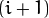
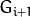
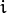
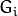
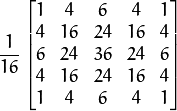
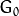
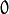

# picZoom

这次我尝试用OpenCV2.14中的函数 <a href="http://opencv.willowgarage.com/documentation/cpp/imgproc_image_filtering.html#cv-pyrup">pyrUp</a> 和  <a href="http://opencv.willowgarage.com/documentation/cpp/imgproc_image_filtering.html#cv-pyrdown">pyrDown</a> 实现图片成倍的放大和缩小。

并对比OpenCV2.14中的函数 <a href="http://opencv.willowgarage.com/documentation/cpp/imgproc_geometric_image_transformations.html#cv-resize">resize</a> 的区别

## 原理

- 当我们想要改变某个图片的大小时，我们可以通过对图片进行 ***缩放*** 来实现。 ***图像金字塔*** 是我们实现图片 ***缩放*** 的一种方法。

- OpenCV中也自带了真正意义上的 ***图像缩放*** 函数 <a href="http://opencv.willowgarage.com/documentation/cpp/imgproc_geometric_image_transformations.html#cv-resize">resize</a> ，之后我们会将他们作对比。

### 图像金字塔

  - 一个图像金字塔是一系列图像的集合 - 所有图像来源于同一张原始图像 - 通过梯次向下采样获得，直到达到某个终止条件才停止采样。

  - 有两种类型的图像金字塔常常出现在文献和应用中: 

    - **高斯金字塔(Gaussian pyramid):** 用来向下采样
    - **拉普拉斯金字塔(Laplacian pyramid):** 用来从金字塔低层图像重建上层未采样图像

    这次我们将使用 *高斯金字塔*。

    #### 高斯金字塔

    - 想想金字塔为一层一层的图像，层级越高，图像越小。

      <div align=center>
      
      </div>
    - 每一层都按从下到上的次序编号， 层级  (表示为  尺寸小于层级  (  ) )。

    - 为了获取层级为  的金字塔图像，我们采用如下方法:

        - 将  与高斯内核卷积:

          <div align=center>
          
          </div>

        - 将所有偶数行和列去除。

    - 显而易见，结果图像只有原图的四分之一。通过对输入图像  (原始图像) 不停迭代以上步骤就会得到整个金字塔。

    - 以上过程描述了对图像的向下采样，如果将图像变大呢?:

        - 首先，将图像在每个方向扩大为原来的两倍，新增的行和列以0填充()
        - 使用先前同样的内核(乘以4)与放大后的图像卷积，获得 “新增像素” 的近似值。


## 代码解释

1. 让我们来回顾一下本程序的总体流程:

   - 装载图像(此处路径由程序设定，用户无需将图像路径当作参数输入)

     ```c++
     /// 测试图像 - 尺寸必须能被 2^{n} 整除
     src = imread("cat.jpg");
     if (!src.data)
     {
     	cout << " No data! -- Exiting the program " << endl;
     	return -1;
     }
     ```

   - 创建两个Mat实例， 一个用来储存操作结果(*dst*)， 另一个用来存储零时结果(*tmp*)。

     ```c++
     Mat src, dst, tmp;
     /* ... */
     tmp = src;
     dst = tmp;
     ```

   - 创建窗口显示结果

     ```c++
     namedWindow( window_name, CV_WINDOW_AUTOSIZE );
     imshow( window_name, dst );
     ```

   - 执行无限循环，等待用户输入。

     ```C++
     while (true)
     {
     	int c;
     	c = waitKey(10);
     	if ((char)c == 27)
     	{
     		break;
     	}
     	if ((char)c == 'u')
     	{
     		pyrUp(tmp, dst, Size(tmp.cols * 2, tmp.rows * 2));
     		cout << "** Zoom In: Image x 2 " << endl;
     	}
     	else if ((char)c == 'd')
     	{
     		pyrDown(tmp, dst, Size(tmp.cols / 2, tmp.rows / 2));
     		cout << "** Zoom Out: Image / 2 " << endl;
     	}
     	imshow(window_name, dst);
     	tmp = dst;
     }
     ```

     如果用户按 *ESC* 键程序退出。 此外，它还提供两个选项:

     - **向上采样 (按 ‘u’)**

       ```C++
       pyrUp( tmp, dst, Size( tmp.cols*2, tmp.rows*2 )
       ```

       函数 [pyrUp](http://opencv.willowgarage.com/documentation/cpp/imgproc_image_filtering.html#cv-pyrup) 接受了3个参数:

       - *tmp*: 当前图像， 初始化为原图像 *src* 。
       - *dst*: 目的图像( 显示图像，为输入图像的两倍)
       - *Size( tmp.cols\*2, tmp.rows*2 )* : 目的图像大小， 既然我们是向上采样， [pyrUp](http://opencv.willowgarage.com/documentation/cpp/imgproc_image_filtering.html#cv-pyrup) 期待一个两倍于输入图像( *tmp* )的大小。

     - **向下采样(按 ‘d’)**

       ```C++
       pyrDown( tmp, dst, Size( tmp.cols/2, tmp.rows/2 )
       ```

       类似于 [pyrUp](http://opencv.willowgarage.com/documentation/cpp/imgproc_image_filtering.html#cv-pyrup), 函数 [pyrDown](http://opencv.willowgarage.com/documentation/cpp/imgproc_image_filtering.html#cv-pyrdown) 也接受了3个参数:

       - *tmp*: 当前图像， 初始化为原图像 *src* 。
       - *dst*: 目的图像( 显示图像，为输入图像的一半)
       - *Size( tmp.cols/2, tmp.rows/2 )* :目的图像大小， 既然我们是向下采样， [pyrDown](http://opencv.willowgarage.com/documentation/cpp/imgproc_image_filtering.html#cv-pyrdown) 期待一个一半于输入图像( *tmp*)的大小。

     - 注意输入图像的大小(在两个方向)必须是2的幂，否则，将会显示错误。

     - 最后，将输入图像 **tmp** 更新为当前显示图像, 这样后续操作将作用于更新后的图像。

       ```c++
       tmp = dst;
       ```

